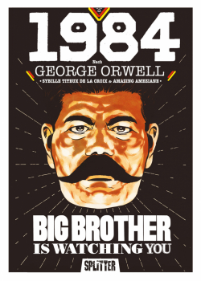
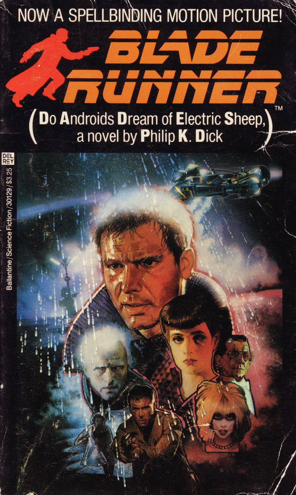
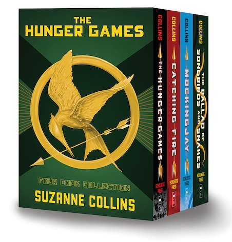
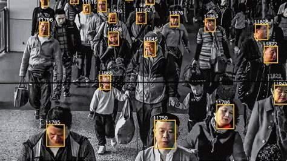
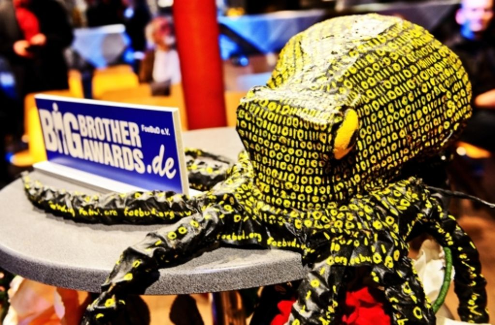

# Dystopian 👁️ Literature

Mark Zink & Fabian Albert, 11.03.2024

# Structure

- Definition
- Characteristics
- Literature
- George Orwell
- Fiction vs. reality
- References

# Definition

> from Ancient Greek δυσ (dus) 'bad', and τόπος (tópos) 'place'

- Antonym of *utopia*, also called *anti-utopia*, *cacotopia*
- Imaginary place/community, extremely bad/frightening

# Characteristics

- Oppressive government
- Mass surveillance
- Strong social classes
- Enviromental decay
- Loss of individuality
- Abuse of technology

## Literature - 1984

<!--
Notizen:
- Protagonist: Winston Smith, Rebell der letztendlich gehirngewaschen wird
- Heutzutage (z.B. im Sinne der Corona-Maßnahmen) gerne umhergeschmissen

Wörter:
- cult of personality: Persönlichkeitskult
- doublethink: Zwiedenken (zwischen Wahrheiten hin-/herschalten)
- thoughtcrime: Gedankenverbrechen
-->

- Written during 1946-1948 by *George Orwell*
- Totalitarian state Oceania, mass surveillance, indoctrination & propaganda
- Dictator: *Big Brother*, huge cult of personality
- Origin of: *doublethink*, *thoughtcrime*, *Ministry of Truth*, *Thought Police*, etc.
- Themes: *nationalism*, *censorship*, *inequality*

## Literature - Do Androids Dream of Electric Sheep?

<!--
Notizen:
- Protagonist: Rick Deckard, hunter
- Androids portrayed as more human(e) than humans

Wörter:
- fallout: Auswirkungen
- servitors: Diener
-->

- Written in 1968 by Philip K. Dick, basis for 1982 movie *Blade Runner*
- Nuclear fallout, mass emigration, intelligent Android servitors
- Protagonist tasked to kill ('retire') 6 rebellious androids back on Earth
- Themes: *morality*, *humanity*, *religion*

## Literature - The Hunger Games

<!--
Notizen:
- Propaganda-Aspekt ähnlich 1984
- Aber: Gewalt statt indirekterer Kontrolle

Wörter:
- televised: im Fernsehen ausgestrahlt
- outright: (einfach) offen
-->

- Trilogy written during 2008-2010 by Suzanne Collins
- Post-apocalyptic nation *Panem*, wealthy *Capitol* & 13 poor *districts*
- Yearly *televised battle royale death game* between the children of the districts
- Outright *violence* as a form of (population) control

## Literature - Brave New World
<!-- 
classes ranging from Alpha++ to Epsilon --
children are produced not born
Anno Ford, Ford Calendar instead of gregorian
T instead of christian cross (Ford Model T)
Fordship, cult instead of religion, frequent ceremonies (Solidarity Service): In these you start by singing and dancing, take Soma and end with an orgie
Difference to 1984: No violence, people are kept satisfied and their needs fullfilled
-->

- Written in 1931 by Aldous Huxley
- Set in a World State, where people are in intelligence based social classes 
- children are "produced" not born
- people are influenced by constant propaganda
- Cult around Henry Ford &rarr; Fordship

## George Orwell - Life

<!-- 
Born 1903 in British India
moved to England with his mother, privileged education, dropped out of uni
worked for the Indian Imperial Police in Burma
moved back to britain

Some racism can be found, "yellow faces", witnessing tortures and not doing anything or quitting (Shooting an elephant)

Seriously wounded

Rape Allegations, Eric & Us, Jacintha Buddcom
In a postscript added by heir cousin, who inherited the copyrights and letters
-->

- Real name: Eric Arthur Blair
- 25.06.1903 (Motihari, India)   - 21.01.1950 (London, Great Britain)
- moved with his mother to britain
- worked for the "Indian Imperial Police" in Burma
- Fought in the spanish civil war

## George Orwell - Literature

- Burmese Days (1934)
- Homage to Catalonia (1938)
- Animal Farm (1945)
- Notes on Nationalism (1949)
- Nineteen Eighty Four (1949)

## Fiction vs. reality - Authoritarian regimes

<!--
Notizen:
- WeChat als Chat-App & Zahlungsmittel
- Beispiel: 'Tiananmen Square 1989'

Wörter:
- glaring: auffallend
-->

- China: Mass surveillance made possible through advanced technology
- Online identity centralized and monitored through *super-app WeChat*
- Strong social classes through *social credit scoring*
- Glaring similarities to e.g. *Oceania* in *1984*

## Fiction vs. reality - Corporate overreach

<!--
Notizen:
- Tendenz: Privatssphäre für Komfort abzugeben
- Abhängigkeit (auch Staats-OPSEC) an externe Unternehmen
- Zu wenig Inzentiven für gute Datensicherheit
- Fragwürdige Moral der Unternehmen, Profit über alles

Wörter:
- rampant: massiv verbreitet
-->

- Few giant companies control most of our daily lives (*jobs*, *news*, *credit scores*)
- Central problem: *comfort* <=> *privacy*
- Misuse of this (centralized) data already rampant, only getting worse
- China: Companies play huge role in government's control

## Fiction vs. reality - Orwell's worst nightmare

<!--
Notizen:
- TV der Firma Telly, für erste 500.000 Menschen 'kostenlos'
- Spioniert offen Benutzer aus, Kamera & Mikro dabei
- Orwells Perspektive: Menschen stellen freiwillig Abhörgerät ins Zimmer

Wörter:
- bugging device: Abhörgerät
-->

# Our favorite dystopia

# Thanks for your 👁️ attention!

Mark Zink & Fabian Albert, 11.03.2024

## Text references - 1/2

- https://www.readwritethink.org/sites/default/files/resources/lesson_images/lesson926/DefinitionCharacteristics.pdf (ReadWriteThink, 08.03.2024)
- https://literaturhandbuch.de/inhaltsangabe-1984-von-george-orwell (Literaturhandbuch, 10.03.2024)
- https://www.nature.com/articles/d41586-018-02695-7 (Ananyo Bhattacharya, 10.03.2024)
- https://www.palomar.edu/users/cbarkley/e100/shootingessay.htm (Palomar College, 10.03.2024)

## Text references - 2/2

- https://www.socratic-method.com/blog/what-makes-the-hunger-games-a-dystopia (The Socratic Method, 10.03.2024)
- https://citizenlab.ca/2023/06/privacy-in-the-wechat-ecosystem-full-report (The Citizen Lab, 10.03.2024)
- https://www.wired.com/story/telly-tv-free-privacy (Wired, 10.03.2024)

## Image references - 1/2

- https://www.ppm-vertrieb.de/images/product_images/info_images/314300-20210409140200.jpg (Peter Poluda Medienvertrieb, 10.03.2024)
- https://i0.wp.com/scifiempire.net/wordpress/wp-content/uploads/2012/07/Do-Androids-Dream-of-Electric-Sheep-cover-novel-by-Philip-K.-Dick.jpg (SciFiEmpire, 10.03.2024)
- https://d3ddkgxe55ca6c.cloudfront.net/assets/t1619522732/a/46/35/206974-ml-1953076.jpg (Scholastic, 10.03.2024)
- https://blackwells.co.uk/jacket/l/9780099511434.jpg (Blackwells, 10.03.2024)

## Image references - 2/2

- https://upload.wikimedia.org/wikipedia/en/6/62/BraveNewWorld_FirstEdition.jpg (Chatto and Windus, 10.03.2024)
- https://www.zdf.de/assets/big-brother-per-app-100~1280x720?cb=1660724657662 (ZDF, 10.03.2024)
- https://www.stuttgarter-zeitung.de/media.media.750bc471-2800-410b-a176-6e1552a21ec8.original1024.jpg (Stuttgarter Zeitung, 10.03.2024)
- https://libroslibroslibros.com/wp-content/uploads/George-Orwell-201x300.jpg (Libros Libros Libros, 10.03.2024)
- https://victorian-era.org/images/george-orwell-scaled.jpg (Victorian Era, 10.03.2024)