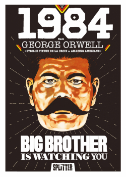
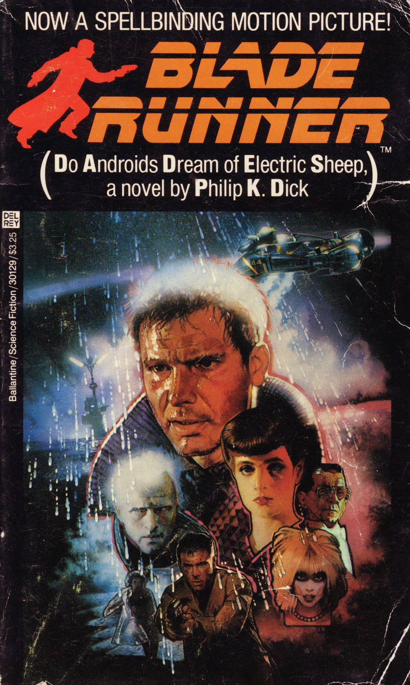
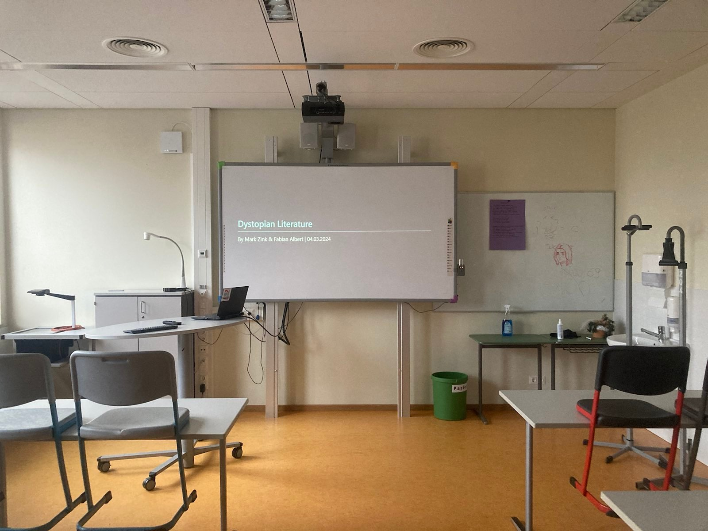

# Dystopian 👁️ Literature

Mark Zink & Fabian Albert, 11.03.2024

# Structure

- Definition
- Characteristics
- Books
- Authors
- Fiction vs. reality
- References

# Definition

> from Ancient Greek δυσ (dus) 'bad', and τόπος (tópos) 'place'

- Antonym of *utopia*, also called *anti-utopia*, *cacotopia*
- Imaginary place/community, extremely bad/frightening

# Characteristics

- Oppressive government
- Mass surveillance
- Strong social classes
- Enviromental decay
- Loss of individuality
- Abuse of technology

## 1984

## Do Androids Dream of Electric Sheep?

## The Hunger Games

## We

## Brave New World

# ... and authors

- Aldous Huxley
- George Orwell
- Philip K. Dick

# Fiction vs. reality

<!--
Wörter:
- bugging device: Überwachungsgerät
-->

| Category | Fiction | Real Life | Country of Origin | 
| - | - | - | - |
| Mass Surveilance | TV with camera and microphone | bugging device | GDR

# Our favorite dystopia

# Thanks for your 👁️ attention!

Mark Zink & Fabian Albert, 11.03.2024

## Text references

- https://www.masterclass.com/articles/what-is-dystopian-fiction-learn-about-the-5-characteristics-of-dystopian-fiction-with-examples?__cf_chl_tk=AL145cC15G6Y_XmEt7GaAzBfaJEIvy2Woefj.KsP7Lo-1709218582-0.0-1831
- https://www.readwritethink.org/sites/default/files/resources/lesson_images/lesson926/DefinitionCharacteristics.pdf
- https://www.panmacmillan.com/blogs/literary/the-best-dystopian-novels-of-all-time
- https://reedsy.com/discovery/blog/dystopian-novels

## Image references

- https://www.ppm-vertrieb.de/images/product_images/info_images/314300-20210409140200.jpg (Peter Poluda Medienvertrieb, 10.03.2024)
- https://i0.wp.com/scifiempire.net/wordpress/wp-content/uploads/2012/07/Do-Androids-Dream-of-Electric-Sheep-cover-novel-by-Philip-K.-Dick.jpg (SciFiEmpire, 10.03.2024)
- https://d3ddkgxe55ca6c.cloudfront.net/assets/t1619522732/a/46/35/206974-ml-1953076.jpg (Scholastic, 10.03.2024)
- https://blackwells.co.uk/jacket/l/9780099511434.jpg (Blackwells, 10.03.2024)
- https://upload.wikimedia.org/wikipedia/en/6/62/BraveNewWorld_FirstEdition.jpg (Chatto and Windus, 10.03.2024)