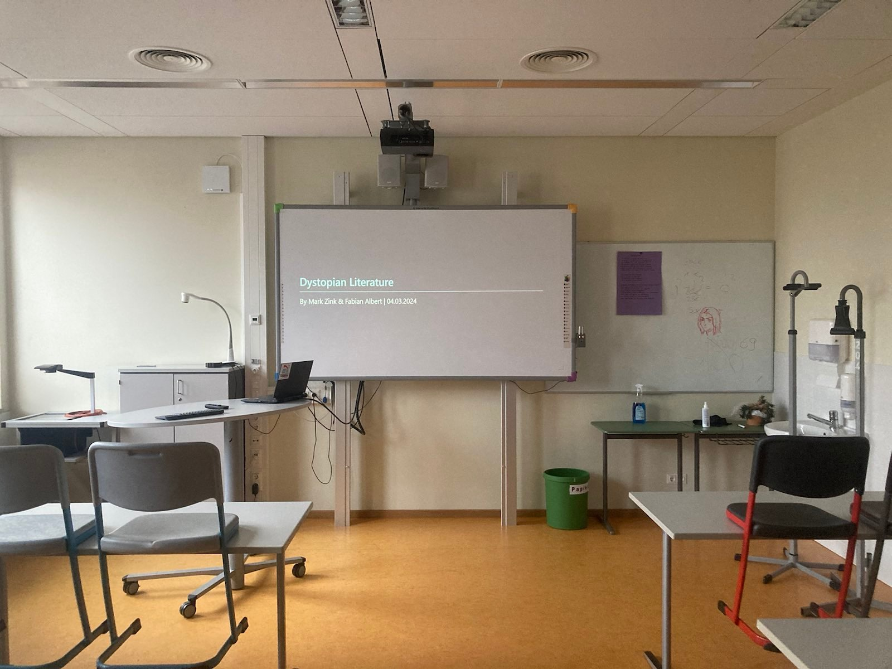

# Dystopian 👁️ Literature

Mark Zink & Fabian Albert, 11.03.2024

# Structure

1. **Characteristics**
2. **Significant books**
3. **... and authors**
4. **Fiction vs. reality**
5. **Our favorite dystopia**

# Characteristics

- Oppressive government
- Enviromental decline
- Strong social classes
- Loss of individuality
- Mass surveillance
- Corporate control

# Significant books

- Brave New World
- 1984
- Pig Farm
- The Hunger Games
- Do Androids Dream of Electric Sheep (Bitte prüfen)
- Blade Runner (Bitte prüfen)
- We (Bitte prüfen)

# ... and authors

- Aldous Huxley
- George Orwell
- Philip K. Dick

# Fiction vs. reality

<!--
Wörter:
- bugging device: Überwachungsgerät
-->

| Category | Fiction | Real Life | Country of Origin | 
| - | - | - | - |
| Mass Surveilance | TV with camera and microphone | bugging device | GDR

# Our favorite dystopia

# Thanks for your 👁️ attention!

Mark Zink & Fabian Albert, 11.03.2024

# Sources

- https://www.masterclass.com/articles/what-is-dystopian-fiction-learn-about-the-5-characteristics-of-dystopian-fiction-with-examples?__cf_chl_tk=AL145cC15G6Y_XmEt7GaAzBfaJEIvy2Woefj.KsP7Lo-1709218582-0.0-1831
- https://www.readwritethink.org/sites/default/files/resources/lesson_images/lesson926/DefinitionCharacteristics.pdf
- https://www.panmacmillan.com/blogs/literary/the-best-dystopian-novels-of-all-time
- https://reedsy.com/discovery/blog/dystopian-novels