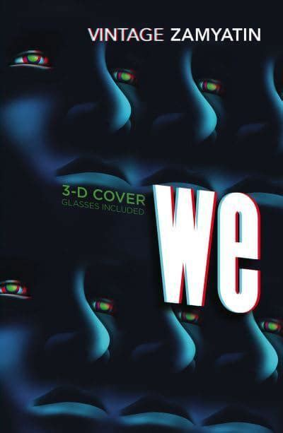

# Dystopian 👁️ Literature

Mark Zink & Fabian Albert, 11.03.2024

# Structure

- Definition
- Characteristics
- Literature
- George Orwell
- Fiction vs. reality
- References

# Definition

> from Ancient Greek δυσ (dus) 'bad', and τόπος (tópos) 'place'

- Antonym of *utopia*, also called *anti-utopia*, *cacotopia*
- Imaginary place/community, extremely bad/frightening

# Characteristics

- Oppressive government
- Mass surveillance
- Strong social classes
- Enviromental decay
- Loss of individuality
- Abuse of technology

## Literature - 1984

<!--
Notizen:
- Protagonist: Winston Smith, Rebell der letztendlich gehirngewaschen wird
- Heutzutage (z.B. im Sinne der Corona-Maßnahmen) gerne umhergeschmissen

Wörter:
- cult of personality: Persönlichkeitskult
- doublethink: Zwiedenken (zwischen Wahrheiten hin-/herschalten)
- thoughtcrime: Gedankenverbrechen
-->

- Written in 1946-1948 by *George Orwell*
- Totalitarian state Oceania, mass surveillance, indoctrination & propaganda
- Dictator: *Big Brother*, huge cult of personality
- Origin of: *doublethink*, *thoughtcrime*, *Ministry of Truth*, *Thought Police*, etc.
- Themes: *nationalism*, *censorship*, *inequality*

## Literature - Do Androids Dream of Electric Sheep?

<!--
Notizen:
- Protagonist: Rick Deckard, hunter
- Androids portrayed as more human(e) than humans

Wörter:
- fallout: Auswirkungen
- servitors: Diener
-->

- Written in 1968 by Philip K. Dick, basis for 1982 movie *Blade Runner*
- Nuclear fallout, mass emigration, intelligent Android servitors
- Protagonist tasked to kill ('retire') 6 rebellious androids back on Earth
- Themes: *morality*, *humanity*, *religion*

## Literature - The Hunger Games

- WIP

## Literature - We

- WIP

## Literature - Brave New World

- WIP

## George Orwell

- 25.06.1903 (Motihari, India)   - 21.01.1950 (London, Great Britain)
- 

# Fiction vs. reality

- WIP mass surveillance

# Our favorite dystopia

# Thanks for your 👁️ attention!

Mark Zink & Fabian Albert, 11.03.2024

## Text references

- https://www.readwritethink.org/sites/default/files/resources/lesson_images/lesson926/DefinitionCharacteristics.pdf (08.03.2024)
- https://literaturhandbuch.de/inhaltsangabe-1984-von-george-orwell (Literaturhandbuch, 10.03.2024)
- https://www.nature.com/articles/d41586-018-02695-7 (Ananyo Bhattacharya, 10.03.2024)

## Image references

- https://www.ppm-vertrieb.de/images/product_images/info_images/314300-20210409140200.jpg (Peter Poluda Medienvertrieb, 10.03.2024)
- https://i0.wp.com/scifiempire.net/wordpress/wp-content/uploads/2012/07/Do-Androids-Dream-of-Electric-Sheep-cover-novel-by-Philip-K.-Dick.jpg (SciFiEmpire, 10.03.2024)
- https://d3ddkgxe55ca6c.cloudfront.net/assets/t1619522732/a/46/35/206974-ml-1953076.jpg (Scholastic, 10.03.2024)
- https://blackwells.co.uk/jacket/l/9780099511434.jpg (Blackwells, 10.03.2024)
- https://upload.wikimedia.org/wikipedia/en/6/62/BraveNewWorld_FirstEdition.jpg (Chatto and Windus, 10.03.2024)